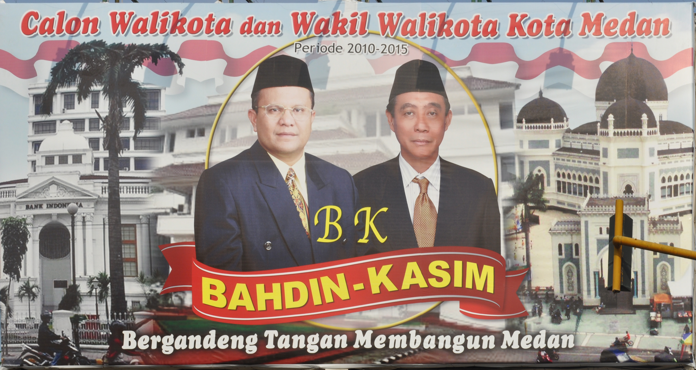

# Example: Image analysis of campaign posters

This example demonstrates multimodal analysis using
[`qlm_code()`](https://quallmer.github.io/quallmer/reference/qlm_code.md)
to extract structured information from images. We analyze Indonesian
mayoral campaign posters from Fox (2023), extracting details about
candidates, visual elements, and symbolic content that would
traditionally require manual human coding.

## Loading packages and data

``` r
library(quallmer)
library(dplyr)
library(knitr)
```

First, we identify the image files to analyze:

``` r
# Get all image files from the data folder
image_files <- list.files("data/images/",
                          pattern = "\\.jpg$",
                          full.names = TRUE)

cat("Found", length(image_files), "campaign poster images:\n")
```

    ## Found 5 campaign poster images:

``` r
print(basename(image_files))
```

    ## [1] "Bahdin.jpg"        "maulana.jpg"       "Sigit_Pramono.jpg"
    ## [4] "Sofyan_tan.jpg"    "Usman_Siregar.jpg"

Let’s preview one of the campaign posters:



## Defining the image analysis codebook

We create a codebook that operationalizes the annotation task. The
schema defines what information to extract from each poster:

``` r
# Define a comprehensive image analysis codebook
codebook_posters <- qlm_codebook(
  name = "Campaign Poster Analysis",
  instructions = paste(
    "You are a political scientist analyzing campaign posters from an",
    "Indonesian mayoral election. Examine each image carefully and",
    "extract the requested information about candidates, visual elements,",
    "and symbolic content."
  ),
  schema = ellmer::type_object(
    mayoral_candidate = ellmer::type_string(
      "Name of the mayoral candidate, or 'unknown' if not visible"
    ),
    deputy_candidate = ellmer::type_string(
      "Name of the deputy mayoral candidate, or 'unknown' if not visible"
    ),
    text_translation = ellmer::type_string(
      "English translation of the Indonesian text in the poster"
    ),
    clothing_description = ellmer::type_string(
      "Description of the clothing the candidates are wearing"
    ),
    indonesian_flag = ellmer::type_boolean(
      "Whether there are visual elements representing the red and white Indonesian flag"
    ),
    religious_buildings = ellmer::type_string(
      "Any religious buildings present and their religion, or 'none' if absent"
    ),
    party_logos = ellmer::type_boolean(
      "Whether there are any party logos in the poster"
    ),
    candidate_percentage = ellmer::type_integer(
      "Estimated percentage of poster taken up by faces and names of candidates (0-100)"
    ),
    facial_expression = ellmer::type_enum(
      c("smiling", "serious", "neutral", "mixed"),
      "Description of candidates' facial expressions"
    )
  ),
  role = "You are an expert in political communication and visual analysis.",
  input_type = "image"
)

# View the codebook structure
codebook_posters
```

    ## quallmer codebook: Campaign Poster Analysis 
    ##   Input type:   image
    ##   Role:         You are an expert in political communication and visual anal...
    ##   Instructions: You are a political scientist analyzing campaign posters fro...
    ##   Output schema:ellmer::TypeObject
    ##   Levels:
    ##     mayoral_candidate: nominal
    ##     deputy_candidate: nominal
    ##     text_translation: nominal
    ##     clothing_description: nominal
    ##     indonesian_flag: nominal
    ##     religious_buildings: nominal
    ##     party_logos: nominal
    ##     candidate_percentage: ordinal
    ##     facial_expression: nominal

The codebook includes: - **Factual information**: Candidate names, text
translations - **Visual elements**: Clothing, flags, religious symbols,
party logos - **Compositional features**: Candidate prominence
(percentage), facial expressions

## Coding images using Gemini 3 Pro Preview

Multimodal models like Gemini 3 Pro Preview can analyze images and
extract structured information. We use
[`qlm_code()`](https://quallmer.github.io/quallmer/reference/qlm_code.md)
with image file paths:

``` r
# Apply image analysis using qlm_code()
coded_posters <- qlm_code(
  image_files,
  codebook = codebook_posters,
  model = "google_gemini/gemini-3-pro-preview",
  name = "campaign_posters_gemini3pro",
  notes = "Analysis of Indonesian mayoral campaign posters from Fox (2023)",
  include_cost = TRUE
)

# Add filenames to results
coded_posters$.filename <- basename(image_files)

# Save results
saveRDS(coded_posters, "data/coded_posters_gemini3pro.rds")
```

## Examining the results

Let’s view the extracted information in a table:

``` r
# Display key results
coded_posters %>%
  select(.filename, mayoral_candidate, deputy_candidate, facial_expression,
         indonesian_flag, party_logos, candidate_percentage) %>%
  kable(
    col.names = c("File", "Mayoral Candidate", "Deputy", "Expression",
                  "Flag", "Logos", "% Candidates"),
    caption = "Campaign Poster Analysis Results"
  )
```

| File | Mayoral Candidate | Deputy | Expression | Flag | Logos | % Candidates |
|:---|:---|:---|:---|:---|:---|---:|
| Bahdin.jpg | Bahdin | Kasim | neutral | TRUE | FALSE | 35 |
| maulana.jpg | Maulana | Arif | smiling | FALSE | FALSE | 65 |
| Sigit_Pramono.jpg | Sigit Pramono Asri, SE | Ir. Hj. Nurlisa Ginting, M.Sc | smiling | TRUE | TRUE | 45 |
| Sofyan_tan.jpg | dr. Sofyan Tan | Nelly Armayanti, SP, MSP | smiling | TRUE | TRUE | 65 |
| Usman_Siregar.jpg | Usman Su ‘Jabrik’ Siregar | Ir Gunawan Ang SH | neutral | FALSE | FALSE | 50 |

Campaign Poster Analysis Results

Total cost for analyzing 5 images: (May not display correctly for a
preview model)

``` r
cat("Total cost: $", round(sum(coded_posters$cost, na.rm = TRUE), 4), sep = "")
```

    ## Total cost: $0

### Text translations

The LLM can translate Indonesian text found in the posters:

``` r
coded_posters %>%
  select(.filename, text_translation) %>%
  kable(
    col.names = c("File", "Text Translation"),
    caption = "Translated Text from Posters"
  )
```

| File | Text Translation |
|:---|:---|
| Bahdin.jpg | Candidate for Mayor and Deputy Mayor of Medan City Period 2010-2015. Bahdin-Kasim. Joining hands to build Medan. |
| maulana.jpg | MARI (Maulana - Arif). Let’s… Fix Medan, Improve the Image. Continue what was delayed. Candidate for Mayor and Deputy Mayor of Medan Period 2010 - 2015 |
| Sigit_Pramono.jpg | SHINING: Together with Sigit-Nurlisa for a Prosperous Medan. God willing we definitely can! Asking for prayers & support to become Mayor & Deputy Mayor of Medan 2010-2015. Free Ambulance Service. |
| Sofyan_tan.jpg | WE CAN TOO..!! dr. Sofyan Tan, Nelly Armayanti, SP, MSP. Candidate for Mayor & Deputy Mayor of Medan, Period 2010-2015. Building an Organized, Humane, Prosperous and Modern Medan City. Asking for Blessings & Support. |
| Usman_Siregar.jpg | We are ‘Medan Kids’ Uncle, Want to be the PEOPLE’S MAYOR Pair from Independent. Usman Su ‘Jabrik’ Siregar Prospective Mayor of Medan 2010-2015 & Ir Gunawan Ang SH Prospective Deputy Mayor of Medan 2010-2015. Bored with nonsense talkers? Support Us Uncle! ‘Medan Kids’ who were born and raised in Medan…! We Wait for a Photocopy of Your ID Card, Now! at Jl. Ismailiyah No. 17/25C Komat I - Medan |

Translated Text from Posters

### Visual elements

Summary of visual elements across all posters:

``` r
# Summarize visual elements
cat("Indonesian flag elements:",
    sum(coded_posters$indonesian_flag, na.rm = TRUE),
    "of", nrow(coded_posters), "posters\n")
```

    ## Indonesian flag elements: 3 of 5 posters

``` r
cat("Party logos present:",
    sum(coded_posters$party_logos, na.rm = TRUE),
    "of", nrow(coded_posters), "posters\n")
```

    ## Party logos present: 2 of 5 posters

``` r
cat("\nFacial expressions:\n")
```

    ## 
    ## Facial expressions:

``` r
print(table(coded_posters$facial_expression))
```

    ## 
    ## smiling serious neutral   mixed 
    ##       3       0       2       0

``` r
cat("\nCandidate prominence (% of poster):\n")
```

    ## 
    ## Candidate prominence (% of poster):

``` r
cat("Range:", min(coded_posters$candidate_percentage, na.rm = TRUE), "-",
    max(coded_posters$candidate_percentage, na.rm = TRUE), "%\n")
```

    ## Range: 35 - 65 %

``` r
cat("Mean:", round(mean(coded_posters$candidate_percentage, na.rm = TRUE), 1), "%\n")
```

    ## Mean: 52 %

## Detailed view of one poster

Let’s examine the complete analysis for one poster:

``` r
# Select the first poster for detailed view
poster_detail <- coded_posters[1, ]

cat("=== Detailed Analysis ===\n\n")
```

    ## === Detailed Analysis ===

``` r
cat("File:", poster_detail$.filename, "\n\n")
```

    ## File: Bahdin.jpg

``` r
cat("Mayoral candidate:", poster_detail$mayoral_candidate, "\n")
```

    ## Mayoral candidate: Bahdin

``` r
cat("Deputy candidate:", poster_detail$deputy_candidate, "\n")
```

    ## Deputy candidate: Kasim

``` r
cat("Text translation:", poster_detail$text_translation, "\n\n")
```

    ## Text translation: Candidate for Mayor and Deputy Mayor of Medan City Period 2010-2015. Bahdin-Kasim. Joining hands to build Medan.

``` r
cat("Clothing:", poster_detail$clothing_description, "\n")
```

    ## Clothing: Both candidates are wearing dark formal suits, ties, and black peci caps.

``` r
cat("Religious buildings:", poster_detail$religious_buildings, "\n\n")
```

    ## Religious buildings: Great Mosque of Medan (Islamic)

``` r
cat("Indonesian flag present:", poster_detail$indonesian_flag, "\n")
```

    ## Indonesian flag present: TRUE

``` r
cat("Party logos present:", poster_detail$party_logos, "\n")
```

    ## Party logos present: FALSE

``` r
cat("Candidate percentage:", poster_detail$candidate_percentage, "%\n")
```

    ## Candidate percentage: 35 %

``` r
cat("Facial expression:", poster_detail$facial_expression, "\n")
```

    ## Facial expression: 3


## Comparing to other models (optional)

You can code the same images with different models to compare results:

``` r
# Try with GPT-4o for comparison
coded_gpt4o <- qlm_code(
  image_files,
  codebook = codebook_posters,
  model = "openai/gpt-4o",
  name = "campaign_posters_gpt4o"
)

# Compare agreement between models
qlm_compare(
  coded_posters,
  coded_gpt4o,
  by = "facial_expression",
  level = "nominal"
)
```

## Creating an audit trail

Document the complete analysis:

``` r
qlm_trail(coded_posters, path = "poster_analysis")
```

This creates two files:

- `poster_analysis.rds`: Complete trail object containing the coding
  run, codebook, and metadata
- `poster_analysis.qmd`: Quarto document with full audit trail
  documentation

## Summary

This example demonstrates:

1.  **Multimodal analysis**: Using vision-language models to analyze
    images
2.  **Structured extraction**: Defining a schema to extract specific
    information
3.  **Scalability**: Analyzing multiple images in batch
4.  **Cost efficiency**: Modern multimodal models are increasingly
    affordable
5.  **Reproducibility**: All analysis is documented and can be
    replicated

Multimodal LLMs open new possibilities for qualitative researchers
working with visual data at scale, from political communication to
social media analysis.

## References

Fox, C. A. (2023). Ethnic campaign appeals: To bond, bridge, or bypass?
*Political Communication*, 40(1), 92–114.
<https://doi.org/10.1080/10584609.2022.2132331>
