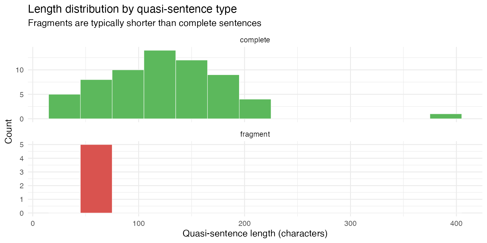

# Example: Quasi-sentence segmentation

The [Manifesto Project](https://manifesto-corpus.wzb.eu/) codes party
manifestos by segmenting them into *quasi-sentences* — the smallest
units carrying a single, complete political statement. A quasi-sentence
is at minimum one natural sentence, but a sentence may be split into
multiple quasi-sentences when it contains two or more unique arguments.
Applying these rules requires judgment: when are two clauses genuinely
independent claims versus elaborations of a single point? This is
exactly the kind of nuanced, instruction-following task where LLMs can
serve as a scalable alternative to human coding.

This article uses
[`qlm_segment()`](https://quallmer.github.io/quallmer/reference/qlm_segment.md)
to apply the Manifesto Project quasi-sentence rules to the 1975 New
Zealand National Party election manifesto, and evaluates how faithfully
the model follows the handbook instructions.

## Packages

``` r

library(quallmer)
library(quanteda)
library(dplyr)
library(ggplot2)
```

## The data

The manifesto is stored as a plain-text file. We read it in and wrap it
in a named character vector so the document identifier appears in the
output corpus.

``` r

manifesto_path <- "data/quasi-sentences/NZ_NP_1966.txt"
manifesto_text <- paste(readLines(manifesto_path), collapse = "\n")
manifesto <- c(NZ_NP_1975 = manifesto_text)
cat(substr(manifesto_text, 1, 500), "...\n")
#> A Guide to what the next National Government will do for New Zealand
#> 
#> THE ECONOMY
#> 
#> In 1972 New Zealand had, for the first time, more overseas reserves than total overseas debt. Labour has dissipated these reserves, borrowed about $200 million overseas and incurred annual interest charges mortgaging almost our total export earnings from butter and cheese.
#> 
#> Inflation in 1972 was about 5 per cent, the second lowest of the Organisation for Economic Co-operation and Development (OECD) nations. Today  ...
```

## The codebook

The codebook instructions are the verbatim text of section 3.2
(“Unitising — Cutting Text into Quasi-Sentences”) from the Manifesto
Project coding handbook (Burst et al., 2021), including the rules for
when to cut and when not to cut, the worked example, and the expected
output. We load the file at runtime and append a short tail telling the
model how to format its output.

``` r

qs_instructions <- paste(
  readLines("data/quasi-sentences/instructions.txt"),
  collapse = "\n"
)

cb_qs <- qlm_codebook(
  name = "Manifesto Project quasi-sentence segmentation",
  instructions = paste(
    qs_instructions,
    "",
    "Return every quasi-sentence in document order.",
    "Each returned 'text' must be verbatim text copied exactly from the input.",
    "Section headers (capitalised lines without end-of-sentence punctuation)",
    "should be joined to the first sentence that follows them.",
    "Mark whether each quasi-sentence is a COMPLETE natural sentence or a FRAGMENT",
    "cut from a larger natural sentence.",
    sep = "\n"
  ),
  schema = ellmer::type_object(
    sentence_type = ellmer::type_enum(
      c("complete", "fragment"),
      description = paste(
        "Whether this quasi-sentence is a complete natural sentence ('complete')",
        "or a fragment cut from a larger natural sentence that was split ('fragment')"
      )
    ),
    reason = ellmer::type_string("Rule governing the segmentation decision.")
  ),
  role = "You are an expert political science coder trained in the Manifesto Project methodology."
)

cb_qs
#> quallmer codebook: Manifesto Project quasi-sentence segmentation 
#>   Input type:   text
#>   Role:         You are an expert political science coder trained in the Man...
#>   Instructions: 3.2 Unitising - Cutting Text into Quasi-Sentences
#> 
#> The codin...
#>   Output schema:ellmer::TypeObject
#>   Levels:
#>     sentence_type: nominal
#>     reason: nominal
```

## Segmenting the manifesto

``` r

segs_manifesto <- qlm_segment(
  manifesto,
  codebook = cb_qs,
  model    = "anthropic/claude-opus-4-6",
  name     = "Claude Opus 4.6"
)
saveRDS(segs_manifesto, "data/segs_manifesto_nz.rds")
```

## Results

### All quasi-sentences

The model produced 68 quasi-sentences from the manifesto. The full
segmentation is shown below. Each quasi-sentence is numbered, labelled
by type (`complete` or `fragment`), and displayed on its own line.

``` r

dv <- docvars(segs_manifesto) |>
  mutate(text = as.character(segs_manifesto))

cat(sprintf("**%d.** _%s_\n> %s\n\n", dv$segid, dv$sentence_type, dv$text))
```

**1.** *fragment* \> A Guide to what the next National Government will
do for New Zealand

**2.** *complete* \> THE ECONOMY

In 1972 New Zealand had, for the first time, more overseas reserves than
total overseas debt.

**3.** *complete* \> Labour has dissipated these reserves, borrowed
about \$200 million overseas and incurred annual interest charges
mortgaging almost our total export earnings from butter and cheese.

**4.** *complete* \> Inflation in 1972 was about 5 per cent, the second
lowest of the Organisation for Economic Co-operation and Development
(OECD) nations.

**5.** *complete* \> Today it is about 15 per cent, well above the OECD
average, and New Zealand has an external deficit per head of population
second only to Iceland.

**6.** *complete* \> The first three years of the coming National
Government will be very largely devoted to restoring New Zealand’s
shattered economy.

**7.** *complete* \> Continuous attention to economic trends and
problems will replace stop-go and panic measures.

**8.** *complete* \> And the taxation system will be used to give
incentives for desirable economic activity.

**9.** *complete* \> We will take steps to stimulate savings.

**10.** *complete* \> Savings accounts, limited as to amount, will be
established.

**11.** *complete* \> The deposits of individuals will earn an interest
rate at least equal to the annual rate of inflation thus preserving the
purchasing power of savings.

**12.** *complete* \> We believe that continued double-figure inflation
will destroy the basis of the New Zealand economy and cause untold
misery.

**13.** *complete* \> The fight against increases in the cost of living
is the most important single issue in economic management.

**14.** *fragment* \> People without jobs represent waste of productive
effort:

**15.** *fragment* \> National supports a policy of full employment and
the dignity of labour.

**16.** *complete* \> We do not accept unemployment as a balancing
factor in economic management.

**17.** *complete* \> Finally, the National Development Council will be
restored and consultation resumed between Government departments,
academic specialists and private industry, including farming and
organised labour.

**18.** *complete* \> The vital role of every section of productive
industry will be recognised.

**19.** *complete* \> It is these moves which will put New Zealand on
the way to economic recovery.

**20.** *complete* \> And reduce the spiraling rate of inflation.

**21.** *complete* \> SUPERANNUATION

Seldom has any policy released by an opposition party had the impact
that the National Superannuation scheme has had.

**22.** *complete* \> It is designed to give every New Zealander dignity
and a decent income in retirement.

**23.** *complete* \> Here’s how it will operate:

**24.** *complete* \> Anyone who is 60 years old, or more, and who has
lived in New Zealand for at least ten years will receive National
Superannuation, starting next year.

**25.** *complete* \> And with three big annual jumps in the rate of
benefit it will be fully operating by 1978.

**26.** *complete* \> To guarantee our elderly retired folk a decent
minimum income, the full rate of National Superannuation, for a married
couple, will be 80% of the average weekly ordinary time wage.

**27.** *complete* \> It will be recalculated every six months.

**28.** *fragment* \> In 1976, to start the scheme, the rate will be 65%
of the average wage;

**29.** *fragment* \> in 1977 it will be raised to 70% and in 1978 to
the full 80%.

**30.** *complete* \> The rate for single persons, at all times, will be
60% of the married rate.

**31.** *complete* \> The present average weekly wage is \$99 and so, if
there is no increase at all in wage rates in the next three years, the
rates of National Superannuation will be shown in the box\* below (\*box
not shown).

**32.** *complete* \> Next year, under National, the age and universal
superannuation benefits will merge to form National Superannuation.

**33.** *complete* \> At present both these benefits pay \$51.26 to a
married couple and \$30.75 to a single person, so even in the first year
of National Superannuation, a married couple over 60 who have no other
income will have \$6.18 a week more to spend than they do now and a
single beneficiary will receive, after tax, \$3.15 a week more than he
now gets by way of age benefits, or universal superannuation.

**34.** *complete* \> Of course those with other income will receive the
benefit too, but they will pay more tax on their bigger incomes.

**35.** *complete* \> By 1978 a married couple will receive a net
\$18.06 a week more than the present age benefit or universal annuation
and a single person will be receiving a net \$10.17 a week more.

**36.** *complete* \> For the single person, that is a pay rise of more
than 33%.

**37.** *complete* \> The big and comforting thing about National
Superannuation is that everyone gets it, just so long as they have lived
in New Zealand for ten years or more and are aged 60 or over.

**38.** *complete* \> They will not, nor will anyone, be expected to
make special contributions over a period of years, in order to qualify.

**39.** *complete* \> The scheme is financed out of ordinary taxation so
there is nothing to be deducted from wages; no special payments of any
kind.

**40.** *complete* \> This means that the present age beneficiary will
receive National Superannuation next year.

**41.** *complete* \> So will the retired Government servant, in
addition to the pension from the Government superannuation fund which he
had paid for.

**42.** *complete* \> And so will all the people who are drawing
pensions from company and other private superannuation schemes.

**43.** *complete* \> In recent weeks, the Government has been making
moves to compensate for the weaknesses revealed in their own scheme,
when compared with National’s.

**44.** *complete* \> But the fact remains that National’s is the only
superannuation scheme that offers a fair deal to everyone in their years
of retirement.

**45.** *complete* \> WOMEN’S RIGHTS

Since 1975 is International Women’s Year, it can be expected that all
political parties will talk a great deal about their ‘women’s policies’.

**46.** *complete* \> Unfortunately most will be little more than window
dressing.

**47.** *complete* \> National’s plans go far beyond this.

**48.** *complete* \> We will begin by introducing legislation to remove
existing legal discrimination relating to women, and to prohibit
discrimination against any person by reason of sex.

**49.** *complete* \> We will also establish a Human Rights Commission
which will ensure that equal rights legislation is enforced and that
women have an effective and inexpensive means of redress.

**50.** *complete* \> The Commission will investigate cases of
discrimination presented to it and recommend civil action to the
Attorney-General.

**51.** *complete* \> Full consideration will be given to the
recommendations of the Select Committee on Women’s Rights.

**52.** *complete* \> We will set priorities for implementation, in
consultation with women’s organisations.

**53.** *complete* \> We will legislate to ensure that all areas of
discrimination in employment are removed and that merit is the sole
criterion in respect of job applications, selection and promotion.

**54.** *complete* \> To encourage women who wish to enter, return to or
remain in employment, National will encourage employers to establish
flexible working patterns, such as glide time, part-time, job sharing,
and multi-shift work.

**55.** *complete* \> Thus assisting women who undertake the dual role
of worker and mother.

**56.** *complete* \> We will give special attention to the problems
associated with re-entry to the work force and ensure that greater job
retraining opportunities are available.

**57.** *complete* \> Maternity leave without pay will be available to
women for a period of up to 12 weeks, without loss of job security,
promotion or superannuation rights, providing this does not cause undue
disruption to a business enterprise.

**58.** *complete* \> The new National Government will appoint women to
boards, commissions and tribunals and will give consideration to the
appointment of women as industrial mediators.

**59.** *complete* \> We will also support increased participation of
women in the judicial system and recognise no sex barriers in the
exercise of any judicial office.

**60.** *complete* \> Suitably qualified women will be given exactly the
same consideration as men.

**61.** *complete* \> National will ensure that early childhood
education is generally available, where feasible, as an integral part of
the education system.

**62.** *complete* \> Priority will be given to such areas as new
housing suburbs and regenerated inner city areas.

**63.** *complete* \> Financial assistance will be provided through
approved voluntary agencies to establish centres for those children who
need day care but whose parents cannot afford to pay the full cost.

**64.** *complete* \> National will also promote and encourage job
training and retraining, “second chance” education and promote a policy
of life-long education for women.

**65.** *complete* \> We will tackle the problems women face with
housing.

**66.** *complete* \> Under National the Housing Corporation will not
differentiate between men and women borrowers on grounds of sex.

**67.** *complete* \> We will introduce a flexible principal repayment
plan to meet those cases where the wife works, leaves the work force to
raise a family and then returns to work.

**68.** *complete* \> The National Party believes all women must have
the opportunity to participate on the basis of full equality in the
social, cultural, economic and political spheres of New Zealand society.

### Complete sentences versus fragments

Quasi-sentences labelled `fragment` were cut from a natural sentence
that contained more than one unique argument. The split rate provides a
rough calibration check: a very low rate suggests the model is treating
every sentence as a single unit; a very high rate suggests
over-splitting.

``` r

dv |>
  count(sentence_type) |>
  mutate(pct = round(100 * n / sum(n), 1)) |>
  knitr::kable(
    col.names = c("Sentence type", "Count", "%"),
    caption   = "Quasi-sentence types"
  )
```

| Sentence type | Count |    % |
|:--------------|------:|-----:|
| complete      |    63 | 92.6 |
| fragment      |     5 |  7.4 |

Quasi-sentence types {.table}

As an additional sanity check, fragments cut from natural sentences
should tend to be shorter than complete sentences. The distribution of
segment lengths (in characters) confirms this pattern:

``` r

dv |>
  mutate(
    nchar         = nchar(text),
    sentence_type = factor(sentence_type, levels = c("complete", "fragment"))
  ) |>
  ggplot(aes(x = nchar, fill = sentence_type)) +
  geom_histogram(binwidth = 30, colour = "white", linewidth = 0.2) +
  facet_wrap(~sentence_type, ncol = 1, scales = "free_y") +
  scale_fill_manual(values = c(complete = "#5cb85c", fragment = "#d9534f"), guide = "none") +
  labs(
    x        = "Quasi-sentence length (characters)",
    y        = "Count",
    title    = "Length distribution by quasi-sentence type",
    subtitle = "Fragments are typically shorter than complete sentences"
  ) +
  theme_minimal()
```



### Coding decisions: why sentences were split

The table below shows every quasi-sentence the model labelled as a
`fragment` — a piece cut from a natural sentence that contained more
than one unique argument — together with the preceding quasi-sentence
for context and the model’s cited reason for the split. These are the
cases most worth human review: each fragment should represent a
genuinely distinct political claim.

``` r

fragment_ids <- which(dv$sentence_type == "fragment")
pred_ids     <- pmax(1L, fragment_ids - 1L)
pair_rows    <- sort(unique(c(pred_ids, fragment_ids)))

dv[pair_rows, ] |>
  mutate(
    role   = if_else(sentence_type == "fragment", "fragment", "predecessor"),
    reason = if_else(sentence_type == "fragment", reason, "")
  ) |>
  select(segid, role, reason, text) |>
  knitr::kable(
    col.names = c("Seg.", "Role", "Reason", "Text"),
    caption   = "Split decisions: fragments and the model's cited reason"
  )
```

|  | Seg. | Role | Reason | Text |
|:---|---:|:---|:---|:---|
| 1 | 1 | fragment | Header joined with no following sentence directly; treated as standalone header quasi-sentence. | A Guide to what the next National Government will do for New Zealand |
| 13 | 13 | predecessor |  | The fight against increases in the cost of living is the most important single issue in economic management. |
| 14 | 14 | fragment | Fragment introducing the argument about full employment; the colon indicates continuation. | People without jobs represent waste of productive effort: |
| 15 | 15 | fragment | Fragment completing the previous statement about employment policy. | National supports a policy of full employment and the dignity of labour. |
| 27 | 27 | predecessor |  | It will be recalculated every six months. |
| 28 | 28 | fragment | Fragment as part of a sentence listing phased rate increases; the semicolon separates related but distinct year-specific commitments, but these are examples illustrating the same phasing schedule. | In 1976, to start the scheme, the rate will be 65% of the average wage; |
| 29 | 29 | fragment | Fragment continuing the phased rate schedule from the previous quasi-sentence. | in 1977 it will be raised to 70% and in 1978 to the full 80%. |

Split decisions: fragments and the model’s cited reason {.table}

### Coding decisions: near-cuts kept whole

Equally important are sentences the model *could* have split but
correctly kept whole, applying the handbook’s “when not to cut” rules.
The manifesto contains several sentences with conjunctions or listed
items that look splittable at first glance but express a single
argument. Here are a handful of representative cases where the model’s
reason shows it considered and rejected a split:

``` r

near_cuts <- dv |>
  filter(
    sentence_type == "complete",
    grepl("\\band\\b|\\bor\\b", text),
    grepl(
      "single|elaborat|same|one (argument|claim|message|statement)|not.+(split|separate|unique|warrant)",
      reason, ignore.case = TRUE
    )
  ) |>
  slice_head(n = 5)

near_cuts |>
  select(segid, reason, text) |>
  knitr::kable(
    col.names = c("Seg.", "Reason", "Text"),
    caption   = "Near-cut decisions: sentences kept whole despite apparent complexity"
  )
```

| Seg. | Reason | Text |
|---:|:---|:---|
| 3 | Single argument about Labour’s fiscal mismanagement; examples (reserves, borrowing, interest charges) all support one message. | Labour has dissipated these reserves, borrowed about \$200 million overseas and incurred annual interest charges mortgaging almost our total export earnings from butter and cheese. |
| 4 | Single statement about past inflation rate. | Inflation in 1972 was about 5 per cent, the second lowest of the Organisation for Economic Co-operation and Development (OECD) nations. |
| 5 | Single statement contrasting current economic situation with the past; the deficit reference supports the same argument about economic decline. | Today it is about 15 per cent, well above the OECD average, and New Zealand has an external deficit per head of population second only to Iceland. |
| 7 | Single statement about governance approach to the economy. | Continuous attention to economic trends and problems will replace stop-go and panic measures. |
| 12 | Single statement about the dangers of inflation. | We believe that continued double-figure inflation will destroy the basis of the New Zealand economy and cause untold misery. |

Near-cut decisions: sentences kept whole despite apparent complexity
{.table}

## Inter-coder reliability of segmentation

How well does the LLM segmentation agree with the human gold standard?
The `quasisentences` dataset includes the NZ National Party manifesto
segmented by Manifesto Project coders. We can convert both the gold
standard and the LLM output to segmented corpora and compare them with
[`qlm_compare()`](https://quallmer.github.io/quallmer/reference/qlm_compare.md),
which computes Krippendorff’s `_u_α` for unitizing — the standard
reliability measure for segmented text (Krippendorff, 2019, section
12.6).

### Preparing the gold standard

The `quasisentences` dataset contains the Manifesto Project’s
human-coded quasi-sentences. We filter to the NZ manifesto, set a
`docid` matching the LLM corpus, and convert to a segmented corpus with
[`as_qlm_coded()`](https://quallmer.github.io/quallmer/reference/as_qlm_coded.md).

``` r

load("data/quasi-sentences/quasisentences.rda")

gold_nz <- quasisentences[quasisentences$manifesto == "NP 1972", ]
gold_nz$docid <- "NZ_NP_1975"

gold_corp <- as_qlm_coded(
  gold_nz,
  qlm_segment = TRUE,
  source_text = c(NZ_NP_1975 = manifesto_text),
  name        = "Manifesto Project",
  is_gold     = TRUE
)

gold_corp
#> Corpus consisting of 71 documents and 8 docvars.
#> NZ_NP_1975.1 :
#> "A Guide to what the next National Government will do for New..."
#> 
#> NZ_NP_1975.2 :
#> "Labour has dissipated these reserves, borrowed about $200 mi..."
#> 
#> NZ_NP_1975.3 :
#> "Inflation in 1972 was about 5 per cent, the second lowest of..."
#> 
#> NZ_NP_1975.4 :
#> "Today it is about 15 per cent, well above the OECD average,"
#> 
#> NZ_NP_1975.5 :
#> "and New Zealand has an external deficit per head of populati..."
#> 
#> NZ_NP_1975.6 :
#> "The first three years of the coming National Government will..."
#> 
#> [ reached max_ndoc ... 65 more documents ]
```

### Comparing the segmentations

[`qlm_compare()`](https://quallmer.github.io/quallmer/reference/qlm_compare.md)
detects that both inputs are segmented corpora and computes
Krippendorff’s `_u_α` for unitizing — the standard reliability measure
for segmented text. Since `segs_manifesto` was produced by
[`qlm_segment()`](https://quallmer.github.io/quallmer/reference/qlm_segment.md),
it already carries the character-level positions and metadata that
[`qlm_compare()`](https://quallmer.github.io/quallmer/reference/qlm_compare.md)
needs.

``` r

qlm_compare(segs_manifesto, gold_corp)
#> 
#> ── Inter-rater reliability ──
#> 
#> Subjects: 1
#> Raters: 2
#> 
#> ── (boundaries) (unitizing)
#> Krippendorff's alpha (unitizing, binary) [NZ_NP_1975]  0.9477 
#> Krippendorff's alpha (unitizing, binary) [(overall)]   0.9477
#> 
```

## Conclusion

[`qlm_segment()`](https://quallmer.github.io/quallmer/reference/qlm_segment.md)
applies the Manifesto Project quasi-sentence rules to a raw manifesto,
producing a quanteda corpus in which each document is a single political
statement. The `reason` docvar makes it possible to audit both split and
non-split decisions against the handbook rules. The segmented output can
be compared to a human gold standard via
[`qlm_compare()`](https://quallmer.github.io/quallmer/reference/qlm_compare.md),
which computes Krippendorff’s `_u_α` for unitizing — measuring boundary
agreement at the character level. The segmented corpus can also feed
directly into
[`qlm_code()`](https://quallmer.github.io/quallmer/reference/qlm_code.md)
for domain-level coding, reproducing the full Manifesto Project pipeline
within a single R workflow.

## References

Burst, T., Krause, W., Lehmann, P., Lewandowski, J., Matthieß, T., Merz,
N., Regel, S., Zehnter, L. (2021). *Manifesto Corpus. Version: South
America 2021b*. Berlin: WZB Berlin Social Science Center.

Volkens, A., Burst, T., Krause, W., Lehmann, P., Matthieß, T., Merz, N.,
Regel, S., Weßels, B., Zehnter, L. (2021). *The Manifesto Data
Collection. Manifesto Project (MRG/CMP/MARPOR). Version 2021b*. Berlin:
WZB Berlin Social Science Center.
<https://doi.org/10.25522/manifesto.mpds.2021b>
