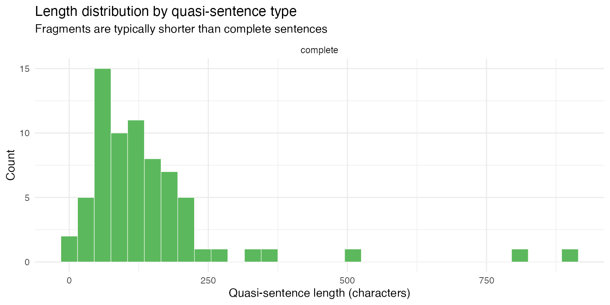

# Example: Quasi-sentence segmentation (test)

The [Manifesto Project](https://manifesto-corpus.wzb.eu/) codes party
manifestos by segmenting them into *quasi-sentences* — the smallest
units carrying a single, complete political statement. A quasi-sentence
is at minimum one natural sentence, but a sentence may be split into
multiple quasi-sentences when it contains two or more unique arguments.
Applying these rules requires judgment: when are two clauses genuinely
independent claims versus elaborations of a single point? This is
exactly the kind of nuanced, instruction-following task where LLMs can
serve as a scalable alternative to human coding.

This article uses
[`qlm_segment()`](https://quallmer.github.io/quallmer/reference/qlm_segment.md)
to apply the Manifesto Project quasi-sentence rules to the 1983 UK
Liberal-SDP Alliance election manifesto, and evaluates how faithfully
the model follows the handbook instructions.

## Packages

``` r
library(quallmer)
library(quanteda)
library(dplyr)
library(ggplot2)
```

## The data

The manifesto text is provided as the `Liberal_SDP_1983` document in
`data_corpus_MPexamples`, a two-document corpus of Manifesto Project
example texts included in quallmer.

``` r
lib_corp <- corpus_subset(data_corpus_MPexamples, country == "UK")
cat(substr(lib_corp, 1, 500), "...\n")
#> ‘Working together for Britain' The General Election on June 9th, 1983 will be seen as a watershed in British politics. It may be recalled as the fateful day when depression became hopelessness and the slide of the post-war years accelerated into the depths of decline. Alternatively it may be remembered as the turning point when the people of this country, at the eleventh hour, decided to turn their backs on dogma and bitterness and chose a new road of partnership and progress. It is to offer rea ...
```

## The codebook

The codebook instructions are the verbatim text of section 3.2
(“Unitising — Cutting Text into Quasi-Sentences”) from the Manifesto
Project coding handbook (Burst et al., 2021), including the rules for
when to cut and when not to cut, the worked example, and the expected
output. We load the file at runtime and append a short tail telling the
model how to format its output.

``` r
qs_instructions <- paste(
  readLines("data/quasi-sentences/instructions_test.txt"),
  collapse = "\n"
)

cb_qs <- qlm_codebook(
  name = "Manifesto Project quasi-sentence segmentation",
  instructions = paste(
    qs_instructions,
    "",
    "Return every quasi-sentence in document order.",
    "Each returned 'text' must be verbatim text copied exactly from the input.",
    "Section headers (capitalised lines without end-of-sentence punctuation)",
    "should be joined to the first sentence that follows them.",
    "Mark whether each quasi-sentence is a COMPLETE natural sentence or a FRAGMENT",
    "cut from a larger natural sentence.",
    sep = "\n"
  ),
  schema = ellmer::type_object(
    sentence_type = ellmer::type_enum(
      c("complete", "fragment"),
      description = paste(
        "Whether this quasi-sentence is a complete natural sentence ('complete')",
        "or a fragment cut from a larger natural sentence that was split ('fragment')"
      )
    ),
    reason = ellmer::type_string("Rule governing the segmentation decision.")
  ),
  role = "You are an expert political science coder trained in the Manifesto Project methodology."
)

cb_qs
#> quallmer codebook: Manifesto Project quasi-sentence segmentation 
#>   Input type:   text
#>   Role:         You are an expert political science coder trained in the Man...
#>   Instructions: 3.2 Unitising - Cutting Text into Quasi-Sentences
#> 
#> The codin...
#>   Output schema:ellmer::TypeObject
#>   Levels:
#>     sentence_type: nominal
#>     reason: nominal
```

## Segmenting the manifesto

``` r
segs_manifesto <- qlm_segment(
  lib_corp,
  codebook = cb_qs,
  model    = "openai/gpt-5.1",
  name     = "GPT 5.1"
)
saveRDS(segs_manifesto, "data/segs_manifesto_lib.rds")
```

## Results

### All quasi-sentences

The model produced 70 quasi-sentences from the manifesto. The full
segmentation is shown below. Each quasi-sentence is numbered, labelled
by type (`complete` or `fragment`), and displayed on its own line.

``` r
dv <- docvars(segs_manifesto) |>
  mutate(text = as.character(segs_manifesto))

cat(sprintf("**%d.** _%s_\n> %s\n\n", dv$segid, dv$sentence_type, dv$text))
```

**1.** *complete* \> ‘Working together for Britain’ The General Election
on June 9th, 1983 will be seen as a watershed in British politics.

**2.** *complete* \> It may be recalled as the fateful day when
depression became hopelessness and the slide of the post-war years
accelerated into the depths of decline.

**3.** *complete* \> Alternatively it may be remembered as the turning
point when the people of this country, at the eleventh hour, decided to
turn their backs on dogma and bitterness and chose a new road of
partnership and progress.

**4.** *complete* \> It is to offer real hope of a fresh start for
Britain that the Alliance between our two parties has been created.

**5.** *complete* \> What we have done is unique in the history of
British parliamentary democracy.

**6.** *complete* \> Two parties, one with a proud history, and one born
only two years ago out of a frustration with the old systems of
politics, have come together to offer an alternative government pledged
to bring the country together again.

**7.** *complete* \> The Conservative and Labour parties between them
have made an industrial wasteland out of a country which was once the
workshop of the world.

**8.** *complete* \> Manufacturing output from Britain is back to the
level of nearly 20 years ago.

**9.** *complete* \> Unemployment is still rising and there are now
generations of school-leavers who no longer even hope for work.

**10.** *complete* \> Mrs Thatcher’s government stands idly by, hoping
that the blind forces of the marketplace will restore the jobs and
factories that its indifference has destroyed.

**11.** *complete* \> The Labour Party’s response is massive further
nationalization, a centralised state socialist economy and rigid
controls over enterprise.

**12.** *complete* \> The choice which Tories and socialists offer at
this election is one between neglect and interference.

**13.** *complete* \> Neither of them understands that it is only by
working together in the companies and communities of Britain that we can
overcome the economic problems which beset us.

**14.** *complete* \> Meanwhile the very fabric of our common life
together deteriorates.

**15.** *complete* \> The record wave of violence and crime and
increased personal stress are all signs of a society at war with itself.

**16.** *complete* \> Rundown cities and declining rural services alike
tell a story of a warped sense of priorities by successive governments.

**17.** *complete* \> Mrs Thatcher promised ‘to bring harmony where
there is discord’.

**18.** *complete* \> Instead her own example of confrontation has
inflamed the bitterness so many people feel at what has happened to
their own lives and local communities.

**19.** *complete* \> Our Alliance wants to call a halt to confrontation
politics.

**20.** *complete* \> We believe we have set an example by working
together as two separate parties within an alliance of principle.

**21.** *complete* \> Our whole approach is based on co-operation: not
just between our parties but between management and workers, between
people of different races and above all between government and people.

**22.** *complete* \> Because we are not prisoners of ideology we shall
listen to the people we represent and ensure that the good sense of the
voters is allowed to illuminate the corridors of Westminster and
Whitehall.

**23.** *complete* \> THE IMMEDIATE CRISIS: JOBS AND PRICES Our economic
crisis demands tough immediate action.

**24.** *complete* \> It also requires a Government with the courage to
implement those strategic and structural reforms which alone can end the
civil war between the two sides of industry.

**25.** *complete* \> The immediate priority is to reduce unemployment.

**26.** *complete* \> Why?

**27.** *complete* \> To the Alliance unemployment is a scandal; robbing
men and women of their careers; blighting the prospects for a quarter of
all our young people, wasting our national resources, aborting our
chances of industrial recovery, dividing our nation and fuelling
hopelessness and crime.

**28.** *complete* \> Much of the present unemployment is a direct
result of the civil war in British industry, of restrictive practices
and low investment.

**29.** *complete* \> But in addition, conservative Government policies
have caused unemployment to rise.

**30.** *complete* \> An Alliance Government would cause unemployment to
fall.

**31.** *complete* \> How?

**32.** *complete* \> Can it be done without releasing a fresh wave of
inflation?

**33.** *complete* \> We believe it can.

**34.** *complete* \> We propose a carefully devised and costed jobs
programmeme aimed at reducing unemployment by 1 million over two years.

**35.** *complete* \> This programmeme will be supported by immediate
measures to help those hardest hit by the slump - the disadvantaged, the
pensioners, the poor.

**36.** *complete* \> Ours is a programmeme of mind, heart and will.

**37.** *complete* \> It is a programme that will work!

**38.** *complete* \> The Programmeme has three points: Fiscal and
Financial Pollicies for Growth; Direct Action to provide jobs; An
Incomes Strategy that will stick.

**39.** *complete* \> STRATEGY FOR INDUSTRIAL SUCCESS The Alliance is
alone in recognising that Britain’s industrial crisis cannot be solved
by short-term measures such as import controls or money supply targets.

**40.** *complete* \> Our crisis goes deep.

**41.** *complete* \> Its roots lie in the class divisions of our
society, in the vested interests of the Tory and Labour parties, in the
refusal of management and unions to wide democracy in industry, in the
way profits and risks are shared.

**42.** *complete* \> The policies offered by the two class-based
parties will further divide the nation North v South, Management v
Labour.

**43.** *complete* \> Our greatest need is to build a sense of belonging
to one community.

**44.** *complete* \> We are all in it together.

**45.** *complete* \> It is impossible for one side or the other in
Britain to ‘win’.

**46.** *complete* \> Conflict in industrial relations means that we all
lose.

**47.** *complete* \> The Alliance is committed to policies which will
invest resources in the hightechnology industries of the future.

**48.** *complete* \> We are committed to a major new effort in
education and training.

**49.** *complete* \> We are pledged to trade union reform to tough
anti-monopoly measures.

**50.** *complete* \> PARTERNSHIP IN INDUSTRY Britain has made little
progress towards industrial democracy, yet several of our European
partners have long traditions of participation and co-operation backed
by legislation.

**51.** *complete* \> They do not face the obstacles to progress with
which our divisive industrial relations present us.

**52.** *complete* \> To be fully effective, proposals for participation
in industry need to be buttressed by action on two fronts: a major
extension of profit sharing and worker share-ownership to give people a
real stake where they work as well as the ability to participate in
decision-taking, and reform of the trade unions to make them genuinely
representative institutions.

**53.** *complete* \> PARTICIPATION AT WORK We propose enabling
legislation that will offer a flexible and sensible approach: An
Industrial Democracy Act to provide for the introduction of employee
participation at all levels, incentives for employee share-ownership,
employee rights to information, and an Industrial Democracy Agency (IDA)
to advise on and monitor the introduction of these measures: Employee
Councils covering each place of work (subject to exemption for small
units) for all companies employing over 1,000 people.

**54.** *complete* \> Smaller companies would also be encouraged to
introduce Employee Councils.

**55.** *complete* \> GOVERNMENT AND INDUSTRY Priority for Industry The
role of an Alliance government in relation to private industry will be
to provide selective assistance taking a number of forms: an industrial
credit scheme to provide low-interest, long-term finance for projects
directed at modernising industry; A national innovation policy, to
provide selective assistance for high-risk projects, particularly
involving the development of new technologies and for research and
development in potential growth industries; public purchasing policies
to stimulate innovation, encourage the introduction of crucial
technologies and aid small businesses; we will establish a Cabinet
Committee chaired by the Prime Minster at the centre of decision-taking
on all policies with a bearing on the performance of industry.

**56.** *complete* \> The Alliance will strengthen the Monopolies’ and
Mergers’ Commission to ensure its ability to prevent monopoly and
unhealthy concentrations of industrial and commercial power.

**57.** *complete* \> The aim is to guarantee fair competition and to
protect the interests of employers, consumers and shareholders.

**58.** *complete* \> New and Small Business To encourage the growth of
new and small businesses, we will attack red tape and provide further
financial and management assistance by: extending the Loan Guarantee
Scheme, in the first instance raising the maximum permitted loan to
£150,000; and the Business Start-Up Scheme, raising the upper limit for
investment to £75,000; and introducing Small Firm Investment Companies
to provide financial and management help; zero-rating building repairs
and maintenance for VAT purposes and reducing commercial rates by 10 per
cent; making sure the Department of Industry co-ordinates and publicises
schemes for small businesses and that government aid ceases to
discriminate against small businesses; tailoring national legislation
such as the Health and Safety Regulations to the needs of small
businesses and amending the statutory sick pay scheme to exclude small
businesses.

**59.** *complete* \> Agriculture and Fisheries Agriculture is an
important industry and employer.

**60.** *complete* \> To encourage its further development we will:
increase Government support for effective agricultural marketing at home
and abroad and continue support for ‘Food from Britain’; ensure that
agriculture has access like other industries to the industrial credit
scheme we propose; encourage greater access to farming, especially by
young entrants.

**61.** *complete* \> The Alliance is determined to safeguard the future
of our fishing industry which needs help to re-build after years of
uncertainty and the drastic consequences for the deep-sea fleet of
200-mile limits in the waters they used to fish.

**62.** *complete* \> Education and training The third basic condition
for industrial success is a people with the skills and self-confidence
that will be needed for the challenges of new technology.

**63.** *complete* \> The education and training systems are not
providing enough people with the skills necessary to make them
employable and the country successful in competition with its rivals.

**64.** *complete* \> We are falling further behind.

**65.** *complete* \> Japan on present plans will be educating all its
young people to the age of 18 by 1990.

**66.** *complete* \> More than 90 per cent of the 16-19 age group in
Germany gain recognised technical qualifications.

**67.** *complete* \> And it is not just a matter of school-leavers.

**68.** *complete* \> Our managers are less professionally qualified
than our main competitors.

**69.** *complete* \> From the bottom to top we are underskilled, and
this has to be put right if we are to prosper in future.

**70.** *complete* \> To do this, to raise standards in education and
training and to improve their effectiveness is the object of proposals
set out in the next Section.

### Complete sentences versus fragments

Quasi-sentences labelled `fragment` were cut from a natural sentence
that contained more than one unique argument. The split rate provides a
rough calibration check: a very low rate suggests the model is treating
every sentence as a single unit; a very high rate suggests
over-splitting.

``` r
dv |>
  count(sentence_type) |>
  mutate(pct = round(100 * n / sum(n), 1)) |>
  knitr::kable(
    col.names = c("Sentence type", "Count", "%"),
    caption   = "Quasi-sentence types"
  )
```

| Sentence type | Count |   % |
|:--------------|------:|----:|
| complete      |    70 | 100 |

Quasi-sentence types

As an additional sanity check, fragments cut from natural sentences
should tend to be shorter than complete sentences. The distribution of
segment lengths (in characters) confirms this pattern:

``` r
dv |>
  mutate(
    nchar         = nchar(text),
    sentence_type = factor(sentence_type, levels = c("complete", "fragment"))
  ) |>
  ggplot(aes(x = nchar, fill = sentence_type)) +
  geom_histogram(binwidth = 30, colour = "white", linewidth = 0.2) +
  facet_wrap(~sentence_type, ncol = 1, scales = "free_y") +
  scale_fill_manual(values = c(complete = "#5cb85c", fragment = "#d9534f"), guide = "none") +
  labs(
    x        = "Quasi-sentence length (characters)",
    y        = "Count",
    title    = "Length distribution by quasi-sentence type",
    subtitle = "Fragments are typically shorter than complete sentences"
  ) +
  theme_minimal()
```



### Coding decisions: why sentences were split

The table below shows every quasi-sentence the model labelled as a
`fragment` — a piece cut from a natural sentence that contained more
than one unique argument — together with the preceding quasi-sentence
for context and the model’s cited reason for the split. These are the
cases most worth human review: each fragment should represent a
genuinely distinct political claim.

``` r
fragment_ids <- which(dv$sentence_type == "fragment")
pred_ids     <- pmax(1L, fragment_ids - 1L)
pair_rows    <- sort(unique(c(pred_ids, fragment_ids)))

dv[pair_rows, ] |>
  mutate(
    role   = if_else(sentence_type == "fragment", "fragment", "predecessor"),
    reason = if_else(sentence_type == "fragment", reason, "")
  ) |>
  select(segid, role, reason, text) |>
  knitr::kable(
    col.names = c("Seg.", "Role", "Reason", "Text"),
    caption   = "Split decisions: fragments and the model's cited reason"
  )
```

| Seg. | Role | Reason | Text |
|------|------|--------|------|

Split decisions: fragments and the model’s cited reason

### Coding decisions: near-cuts kept whole

Equally important are sentences the model *could* have split but
correctly kept whole, applying the handbook’s “when not to cut” rules.
The manifesto contains several sentences with conjunctions or listed
items that look splittable at first glance but express a single
argument. Here are a handful of representative cases where the model’s
reason shows it considered and rejected a split:

``` r
near_cuts <- dv |>
  filter(
    sentence_type == "complete",
    grepl("\\band\\b|\\bor\\b", text),
    grepl(
      "single|elaborat|same|one (argument|claim|message|statement)|not.+(split|separate|unique|warrant)",
      reason, ignore.case = TRUE
    )
  ) |>
  slice_head(n = 5)

near_cuts |>
  select(segid, reason, text) |>
  knitr::kable(
    col.names = c("Seg.", "Reason", "Text"),
    caption   = "Near-cut decisions: sentences kept whole despite apparent complexity"
  )
```

| Seg. | Reason | Text |
|---:|:---|:---|
| 2 | Single main statement about how the day may be recalled. | It may be recalled as the fateful day when depression became hopelessness and the slide of the post-war years accelerated into the depths of decline. |
| 3 | Single alternative description of how the day may be remembered. | Alternatively it may be remembered as the turning point when the people of this country, at the eleventh hour, decided to turn their backs on dogma and bitterness and chose a new road of partnership and progress. |
| 6 | Single statement describing composition and aim of the two parties. | Two parties, one with a proud history, and one born only two years ago out of a frustration with the old systems of politics, have come together to offer an alternative government pledged to bring the country together again. |
| 7 | Single claim about effect of Conservative and Labour parties. | The Conservative and Labour parties between them have made an industrial wasteland out of a country which was once the workshop of the world. |
| 9 | Second clause elaborates consequences of rising unemployment; treated as one argument about unemployment. | Unemployment is still rising and there are now generations of school-leavers who no longer even hope for work. |

Near-cut decisions: sentences kept whole despite apparent complexity

## Inter-coder reliability of segmentation

How well does the LLM segmentation agree with the human gold standard?
The `data_corpus_MPexamplesseg` object provides the Manifesto Project’s
human coding as a ready-to-use segmented corpus. We can compare it
directly against the LLM output with
[`qlm_compare()`](https://quallmer.github.io/quallmer/reference/qlm_compare.md),
which computes Krippendorff’s `_u_α` for unitizing — the standard
reliability measure for segmented text (Krippendorff, 2019, section
12.6).

### Preparing the gold standard

The `data_corpus_MPexamplesseg` object contains the Manifesto Project’s
human-coded quasi-sentences for both example manifestos, already
converted to a segmented corpus. We subset to the Liberal-SDP document.

``` r
data("data_corpus_MPexamplesseg")
gold_corp <- corpus_subset(data_corpus_MPexamplesseg, docid == "Liberal_SDP_1983")
gold_corp
#> Corpus consisting of 107 documents and 7 docvars.
#> Liberal_SDP_1983.1 :
#> "‘Working together for Britain' The General Election on June ..."
#> 
#> Liberal_SDP_1983.2 :
#> "It may be recalled as the fateful day when depression became..."
#> 
#> Liberal_SDP_1983.3 :
#> "Alternatively it may be remembered as the turning point when..."
#> 
#> Liberal_SDP_1983.4 :
#> "It is to offer real hope of a fresh start for Britain that t..."
#> 
#> Liberal_SDP_1983.5 :
#> "What we have done is unique in the history of British parlia..."
#> 
#> Liberal_SDP_1983.6 :
#> "Two parties, one with a proud history, and one born only two..."
#> 
#> [ reached max_ndoc ... 101 more documents ]
```

### Comparing the segmentations

[`qlm_compare()`](https://quallmer.github.io/quallmer/reference/qlm_compare.md)
detects that both inputs are segmented corpora and computes
Krippendorff’s `_u_α` for unitizing — the standard reliability measure
for segmented text. Since `segs_manifesto` was produced by
[`qlm_segment()`](https://quallmer.github.io/quallmer/reference/qlm_segment.md),
it already carries the character-level positions and metadata that
[`qlm_compare()`](https://quallmer.github.io/quallmer/reference/qlm_compare.md)
needs.

``` r
qlm_compare(segs_manifesto, gold_corp)
#> 
#> ── Inter-rater reliability ──
#> 
#> Subjects: 1
#> Raters: 2
#> 
#> ── (boundaries) (unitizing)
#> Krippendorff's alpha (unitizing, binary) [Liberal_SDP_1983]  0.7419 
#> Krippendorff's alpha (unitizing, binary) [(overall)]         0.7419
#> 
```

## Conclusion

[`qlm_segment()`](https://quallmer.github.io/quallmer/reference/qlm_segment.md)
applies the Manifesto Project quasi-sentence rules to a raw manifesto,
producing a quanteda corpus in which each document is a single political
statement. The `reason` docvar makes it possible to audit both split and
non-split decisions against the handbook rules. The segmented output can
be compared to a human gold standard via
[`qlm_compare()`](https://quallmer.github.io/quallmer/reference/qlm_compare.md),
which computes Krippendorff’s `_u_α` for unitizing — measuring boundary
agreement at the character level. The segmented corpus can also feed
directly into
[`qlm_code()`](https://quallmer.github.io/quallmer/reference/qlm_code.md)
for domain-level coding, reproducing the full Manifesto Project pipeline
within a single R workflow.

## References

Burst, T., Krause, W., Lehmann, P., Lewandowski, J., Matthieß, T., Merz,
N., Regel, S., Zehnter, L. (2021). *Manifesto Corpus. Version: South
America 2021b*. Berlin: WZB Berlin Social Science Center.

Volkens, A., Burst, T., Krause, W., Lehmann, P., Matthieß, T., Merz, N.,
Regel, S., Weßels, B., Zehnter, L. (2021). *The Manifesto Data
Collection. Manifesto Project (MRG/CMP/MARPOR). Version 2021b*. Berlin:
WZB Berlin Social Science Center.
<https://doi.org/10.25522/manifesto.mpds.2021b>
