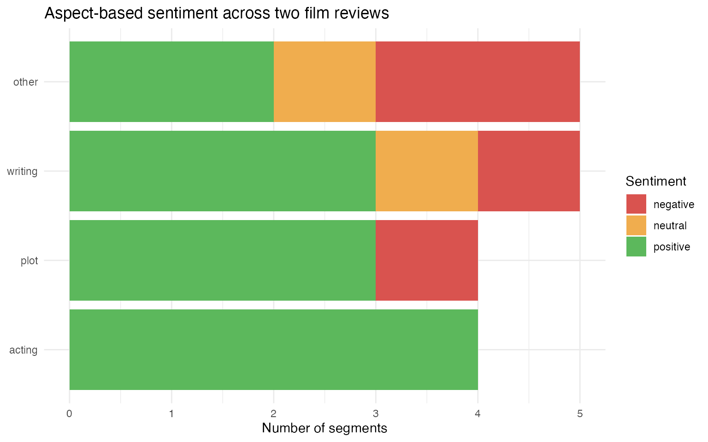
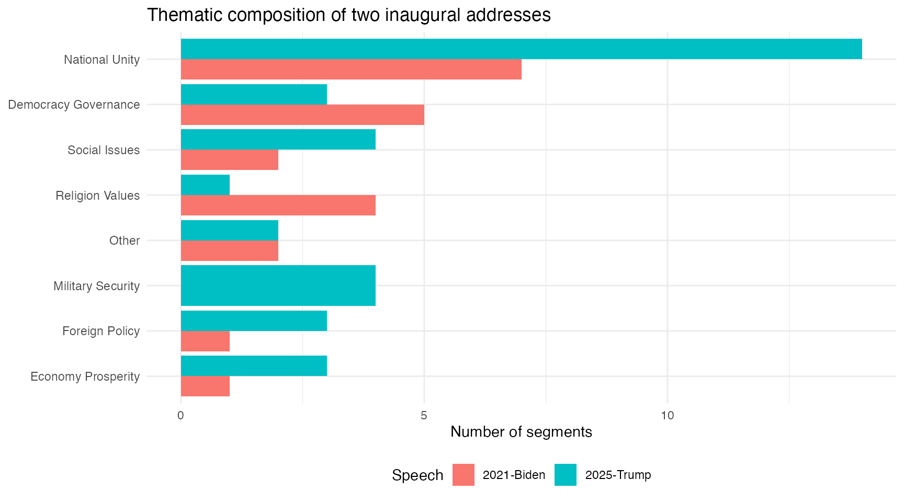

# Example: Text segmentation

[`qlm_segment()`](https://quallmer.github.io/quallmer/reference/qlm_segment.md)
splits a text into thematic or conceptual units and returns a [quanteda
corpus](https://quanteda.io/) with one document per segment. The schema
fields from the codebook become docvars on the output corpus, making it
straightforward to combine LLM-powered segmentation with downstream
quantitative analysis.

This article illustrates two applications: aspect-based sentiment
analysis of film reviews, and thematic segmentation of recent US
presidential inaugural addresses.

## Packages

``` r
library(quallmer)
library(quanteda)
library(dplyr)
library(ggplot2)
```

## Aspect-based sentiment in movie reviews

Aspect-based sentiment analysis (ABSA) asks not just whether a reviewer
is positive or negative overall, but which specific features they
discuss and what they say about each. A review that praises the acting
while criticising the plot will read as moderately positive in
aggregate, but the aspect-level picture is much richer.

### The data

We draw two reviews from `data_corpus_LMRDsample`, the 200-review subset
of the Large Movie Review Dataset bundled with quallmer (Maas et al.,
2011): one negative and one positive.

``` r
set.seed(55)
idx_neg <- which(docvars(data_corpus_LMRDsample)$polarity == "neg")
idx_pos <- which(docvars(data_corpus_LMRDsample)$polarity == "pos")
corp_reviews <- data_corpus_LMRDsample[c(sample(idx_neg, 1), sample(idx_pos, 1))]
corp_reviews
#> Corpus consisting of 2 documents and 3 docvars.
#> 239_2.txt :
#> "Oh, man, they sure knew how to make them back then. Hollywoo..."
#> 
#> 12000_9.txt :
#> "Sorry to repeat myself over and over, but here's another gre..."
```

### The codebook

``` r
cb_absa <- qlm_codebook(
  name = "Aspect-based sentiment",
  instructions = paste(
    "Segment the review into contiguous spans that each address a single aspect",
    "of the film. A segment may be a clause, a sentence, or several sentences.",
    "Label each segment with the aspect it discusses and the expressed sentiment.",
    "",
    "Aspects: acting, cinematography, direction, music, pacing, plot, writing, other.",
    "Return the verbatim text of each segment."
  ),
  schema = ellmer::type_object(
    aspect    = ellmer::type_enum(
      c("acting", "cinematography", "direction", "music", "pacing",
        "plot", "writing", "other"),
      description = "Film aspect discussed in this segment"
    ),
    sentiment = ellmer::type_enum(
      c("negative", "neutral", "positive"),
      description = "Sentiment expressed toward this aspect"
    )
  ),
  role = "You are an expert film critic and NLP researcher."
)

cb_absa
#> quallmer codebook: Aspect-based sentiment 
#>   Input type:   text
#>   Role:         You are an expert film critic and NLP researcher.
#>   Instructions: Segment the review into contiguous spans that each address a...
#>   Output schema:ellmer::TypeObject
#>   Levels:
#>     aspect: nominal
#>     sentiment: nominal
```

### Segmenting the reviews

``` r
segs_reviews <- qlm_segment(
  corp_reviews,
  codebook = cb_absa,
  model    = "openai/gpt-4o-mini",
  name     = "GPT-4o-mini"
)
saveRDS(segs_reviews, "data/segs_reviews.rds")
```

### Segments

Each review is now split into aspect-level segments. The output corpus
carries `docid`, `segid`, `aspect`, and `sentiment`, plus the `polarity`
and `rating` docvars inherited from the source corpus:

``` r
docvars(segs_reviews) |>
  mutate(text = as.character(segs_reviews)) |>
  select(docid, segid, aspect, sentiment, polarity, rating, text) |>
  knitr::kable()
```

| docid | segid | aspect | sentiment | polarity | rating | text |
|:---|---:|:---|:---|:---|---:|:---|
| 239_2.txt | 1 | writing | positive | neg | 2 | Oh, man, they sure knew how to make them back then. |
| 239_2.txt | 2 | writing | negative | neg | 2 | Hollywood has forgotten the basic ingredients of bad movie making: cardboard steel and the god fearing scientist action hero! |
| 239_2.txt | 3 | plot | negative | neg | 2 | This film was so close to a masterpiece, alas it was not to be, as it failed to feature ray guns and invaders from the Moon. |
| 239_2.txt | 4 | writing | neutral | neg | 2 | The MST3K version tried to fix this by adding a pilot of a show called Captain Cody, where a guy with a rocket propelled jacket fights bad make-up people from the Moon, but it didn’t quite add up. |
| 239_2.txt | 5 | other | negative | neg | 2 | Also, the comments of the guys in the theater were not nearly as funny as I expected them to be. |
| 239_2.txt | 6 | other | negative | neg | 2 | All in all, a great disappointment. |
| 12000_9.txt | 1 | other | positive | pos | 9 | Sorry to repeat myself over and over, but here’s another great Columbo episode. I guess that’s why I’m such a fan - most episodes really are great! |
| 12000_9.txt | 2 | plot | positive | pos | 9 | The best episodes always have a standout feature of some sort, and in this case the murderer and his accomplice are possibly the youngest ever Columbo villains. |
| 12000_9.txt | 3 | writing | positive | pos | 9 | After watching a lot of episodes where Columbo and his adversary act like close friends, it’s good to see an episode where tempers fray and bad feelings rise to the surface. |
| 12000_9.txt | 4 | writing | positive | pos | 9 | It just gives an episode a bit more drama and bite. |
| 12000_9.txt | 5 | plot | positive | pos | 9 | Columbo is rapidly onto the fact that the two students who claim to be helping him are not very secretly laughing at him and feeding him false clues. |
| 12000_9.txt | 6 | acting | positive | pos | 9 | He happily plays along, deliberately turning up the bumbling in front of them to make them underestimate him! But of course he knows instantly when they are talking baloney. |
| 12000_9.txt | 7 | plot | positive | pos | 9 | The murder itself is another complicated one, along the lines of The Bye Bye Sky High IQ episode, with a sophisticated chain reaction of events that manages to kill the intended target while providing the assassins with a seemingly watertight alibi. |
| 12000_9.txt | 8 | other | neutral | pos | 9 | In the intervening years between 1978 and 1990, the technology has moved on from record players and firecrackers to remote control car locking systems and hidden cameras. |
| 12000_9.txt | 9 | acting | positive | pos | 9 | Stephen Caffrey puts in a great performance as Justin Rowe, the obnoxious, spoilt student. |
| 12000_9.txt | 10 | acting | positive | pos | 9 | Gary Hershberger is low-key but good as his “yes-man” friend Cooper Redman. |
| 12000_9.txt | 11 | acting | positive | pos | 9 | And it’s nice to see Robert Culp as Mr Rowe, Justin’s dad. |
| 12000_9.txt | 12 | other | positive | pos | 9 | A very satisfying episode in all ways. |

### Sentiment by aspect

Pooling across both reviews, we can see which aspects attract positive
versus negative commentary:

``` r
docvars(segs_reviews) |>
  count(aspect, sentiment) |>
  mutate(
    sentiment = factor(sentiment, levels = c("negative", "neutral", "positive")),
    aspect    = reorder(aspect, n, sum)
  ) |>
  ggplot(aes(x = aspect, y = n, fill = sentiment)) +
  geom_col() +
  scale_fill_manual(
    values = c(negative = "#d9534f", neutral = "#f0ad4e", positive = "#5cb85c")
  ) +
  labs(
    x     = NULL,
    y     = "Number of segments",
    title = "Aspect-based sentiment across two film reviews",
    fill  = "Sentiment"
  ) +
  coord_flip() +
  theme_minimal()
```



## Thematic segmentation of inaugural addresses

Presidential inaugural addresses typically move through several distinct
themes — calls for unity, foreign policy commitments, economic
priorities, statements of national values — often without explicit
markers separating them.
[`qlm_segment()`](https://quallmer.github.io/quallmer/reference/qlm_segment.md)
can recover this thematic structure automatically.

### The data

We use the two most recent speeches in
[`quanteda::data_corpus_inaugural`](https://quanteda.io/reference/data_corpus_inaugural.html):

``` r
corp_inaugural <- tail(data_corpus_inaugural, 2)
corp_inaugural
#> Corpus consisting of 2 documents and 4 docvars.
#> 2021-Biden :
#> "Chief Justice Roberts, Vice President Harris, Speaker Pelosi..."
#> 
#> 2025-Trump :
#> "Thank you.  Thank you very much, everybody.  Wow.  Thank you..."
```

### The codebook

``` r
cb_inaugural <- qlm_codebook(
  name = "Thematic segmentation of inaugural addresses",
  instructions = paste(
    "Segment this inaugural address into contiguous thematic passages.",
    "Begin a new segment when the speaker shifts to a clearly different theme.",
    "Each segment must contain at least one complete sentence.",
    "",
    "Themes:",
    "  democracy_governance  -- democratic institutions, rule of law, elections",
    "  economy_prosperity    -- jobs, industry, trade, economic growth",
    "  foreign_policy        -- international relations, alliances, diplomacy",
    "  military_security     -- armed forces, national security, veterans",
    "  national_unity        -- calls for solidarity, healing, shared identity",
    "  religion_values       -- religious references, moral and cultural values",
    "  social_issues         -- healthcare, education, civil rights, environment",
    "  other                 -- passages that do not fit the above themes"
  ),
  schema = ellmer::type_object(
    theme = ellmer::type_enum(
      c("democracy_governance", "economy_prosperity", "foreign_policy",
        "military_security", "national_unity", "religion_values",
        "social_issues", "other"),
      description = "Thematic label for this passage"
    )
  ),
  role = "You are an expert in American political rhetoric and speech analysis."
)

cb_inaugural
#> quallmer codebook: Thematic segmentation of inaugural addresses 
#>   Input type:   text
#>   Role:         You are an expert in American political rhetoric and speech ...
#>   Instructions: Segment this inaugural address into contiguous thematic pass...
#>   Output schema:ellmer::TypeObject
#>   Levels:
#>     theme: nominal
```

### Segmenting the speeches

``` r
segs_inaugural <- qlm_segment(
  corp_inaugural,
  codebook = cb_inaugural,
  model    = "openai/gpt-4.1-mini"
)
saveRDS(segs_inaugural, "data/segs_inaugural.rds")
```

### Summary of themes

``` r
docvars(segs_inaugural) |>
  count(docid, theme) |>
  tidyr::pivot_wider(names_from = docid, values_from = n, values_fill = 0L) |>
  knitr::kable(caption = "Number of segments by theme and speech")
```

| theme                | 2021-Biden | 2025-Trump |
|:---------------------|-----------:|-----------:|
| democracy_governance |          5 |          3 |
| economy_prosperity   |          1 |          3 |
| foreign_policy       |          1 |          3 |
| national_unity       |          7 |         14 |
| religion_values      |          4 |          1 |
| social_issues        |          2 |          4 |
| other                |          2 |          2 |
| military_security    |          0 |          4 |

Number of segments by theme and speech

### Theme distribution by speech

``` r
docvars(segs_inaugural) |>
  count(docid, theme) |>
  mutate(theme = tools::toTitleCase(gsub("_", " ", theme))) |>
  ggplot(aes(x = reorder(theme, n, sum), y = n, fill = docid)) +
  geom_col(position = "dodge") +
  labs(
    x     = NULL,
    y     = "Number of segments",
    fill  = "Speech",
    title = "Thematic composition of two inaugural addresses"
  ) +
  coord_flip() +
  theme_minimal() +
  theme(legend.position = "bottom")
```



## Reliability of aspect-based segmentation

How reproducible is the ABSA segmentation? We re-segment the same two
reviews with a second model and compare the two runs using
[`qlm_compare()`](https://quallmer.github.io/quallmer/reference/qlm_compare.md),
which computes Krippendorff’s `_u_α` for unitizing (Krippendorff, 2019,
section 12.6).

### A second segmentation

``` r
segs_reviews_2 <- qlm_segment(
  corp_reviews,
  codebook = cb_absa,
  model    = "anthropic/claude-sonnet-4-5",
  name     = "Claude Sonnet 4.5"
)
saveRDS(segs_reviews_2, "data/segs_reviews_2.rds")
```

### Boundary agreement

`|_u_α_binary` tests whether the two models place segment boundaries in
the same locations, ignoring the aspect and sentiment labels:

``` r
alphas <- qlm_compare(segs_reviews, segs_reviews_2)
print(alphas)
#> 
#> ── Inter-rater reliability ──
#> 
#> Subjects: 2
#> Raters: 2
#> 
#> ── (boundaries) (unitizing)
#> Krippendorff's alpha (unitizing, binary) [239_2.txt]    1.0000 
#> Krippendorff's alpha (unitizing, binary) [12000_9.txt]  0.9364 
#> Krippendorff's alpha (unitizing, binary) [(overall)]    0.9576
#> 

as.data.frame(alphas)
#>       variable     level        measure     value       docid      rater1
#> 1 (boundaries) unitizing alpha_u_binary 1.0000000   239_2.txt GPT-4o-mini
#> 2 (boundaries) unitizing alpha_u_binary 0.9363609 12000_9.txt GPT-4o-mini
#> 3 (boundaries) unitizing alpha_u_binary 0.9576468   (overall) GPT-4o-mini
#>              rater2
#> 1 Claude Sonnet 4.5
#> 2 Claude Sonnet 4.5
#> 3 Claude Sonnet 4.5
```

### Boundary and sentiment agreement

When we pass `by = "sentiment"`, `_u_α_nominal` tests both boundary
placement and whether the models agree on the sentiment label assigned
to each span:

``` r
alphas_by <- qlm_compare(segs_reviews, segs_reviews_2, by = "sentiment")
print(alphas_by)
#> 
#> ── Inter-rater reliability ──
#> 
#> Subjects: 2
#> Raters: 2
#> 
#> ── sentiment (unitizing)
#> Krippendorff's alpha (unitizing) [239_2.txt]                  0.3123 
#> Krippendorff's alpha (unitizing) [12000_9.txt]                0.9943 
#> Krippendorff's alpha (unitizing) [(overall)]                  0.8310 
#> Krippendorff's alpha (coding | unitizing) [(overall)]         0.8276 
#> alpha (unitizing, value=positive) [(overall, coverage=100%)]  1.0000 
#> alpha (unitizing, value=negative) [(overall, coverage=100%)]  0.7444 
#> alpha (unitizing, value=neutral) [(overall, coverage=100%)]   0.5999
#> 

as.data.frame(alphas_by)
#>    variable     level                     measure     value
#> 1 sentiment unitizing             alpha_u_nominal 0.3122950
#> 2 sentiment unitizing             alpha_u_nominal 0.9942546
#> 3 sentiment unitizing             alpha_u_nominal 0.8310061
#> 4 sentiment unitizing            alpha_cu_nominal 0.8276303
#> 5 sentiment unitizing alpha_u_per_value[positive] 1.0000000
#> 6 sentiment unitizing alpha_u_per_value[negative] 0.7444180
#> 7 sentiment unitizing  alpha_u_per_value[neutral] 0.5998600
#>                      docid      rater1            rater2
#> 1                239_2.txt GPT-4o-mini Claude Sonnet 4.5
#> 2              12000_9.txt GPT-4o-mini Claude Sonnet 4.5
#> 3                (overall) GPT-4o-mini Claude Sonnet 4.5
#> 4                (overall) GPT-4o-mini Claude Sonnet 4.5
#> 5 (overall, coverage=100%) GPT-4o-mini Claude Sonnet 4.5
#> 6 (overall, coverage=100%) GPT-4o-mini Claude Sonnet 4.5
#> 7 (overall, coverage=100%) GPT-4o-mini Claude Sonnet 4.5
```

The per-review breakdown shows which texts are more or less consistently
segmented, while the overall row is the value to report.

## Conclusion

[`qlm_segment()`](https://quallmer.github.io/quallmer/reference/qlm_segment.md)
turns unstructured text into a quanteda corpus where each document is a
semantically coherent unit. The output integrates directly with
quanteda’s ecosystem — frequency tables, readability measures, or
further LLM coding of individual segments with
[`qlm_code()`](https://quallmer.github.io/quallmer/reference/qlm_code.md).
The ABSA example shows how mixed sentiment can be obscured in aggregate
scores; the inaugural address example shows how thematic structure can
be recovered automatically from long-form political text. Segmented
corpora can be compared across models or runs with
[`qlm_compare()`](https://quallmer.github.io/quallmer/reference/qlm_compare.md),
which computes Krippendorff’s `_u_α` for unitizing — measuring both
boundary and coding agreement at the character level.

## References

Maas, A. L., Daly, R. E., Pham, P. T., Huang, D., Ng, A. Y., & Potts, C.
(2011). Learning word vectors for sentiment analysis. *Proceedings of
the 49th Annual Meeting of the Association for Computational
Linguistics*, 142–150.
